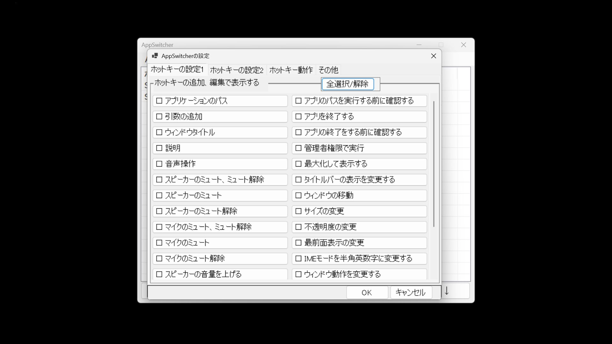
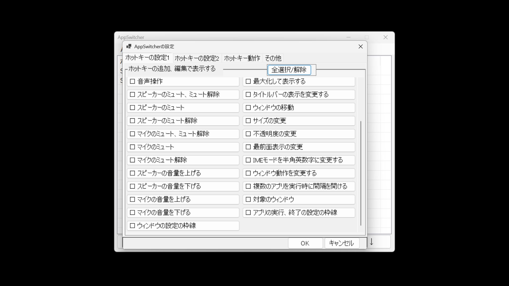
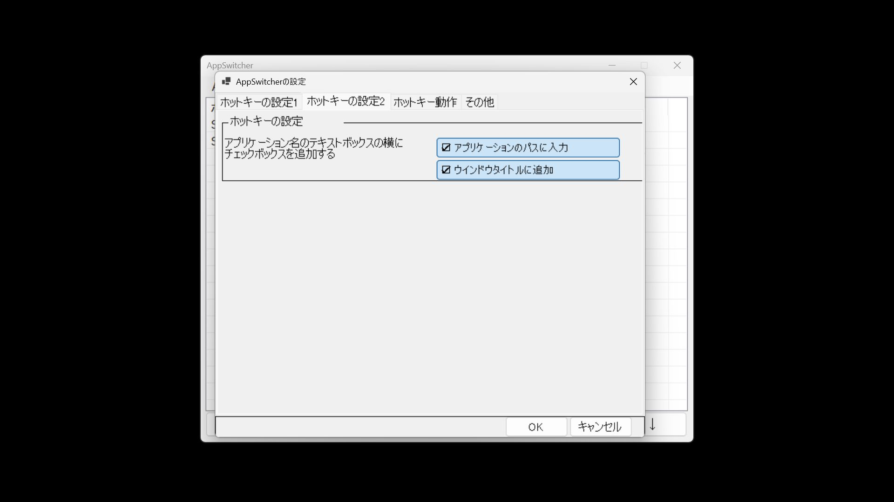
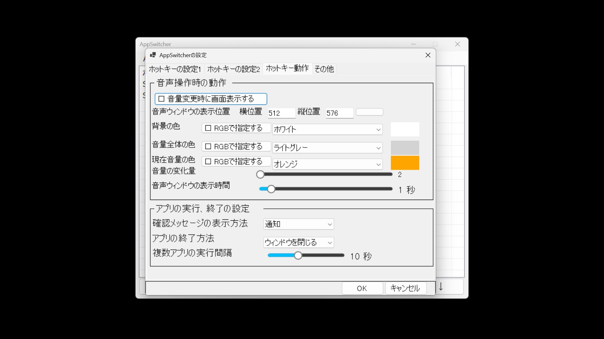
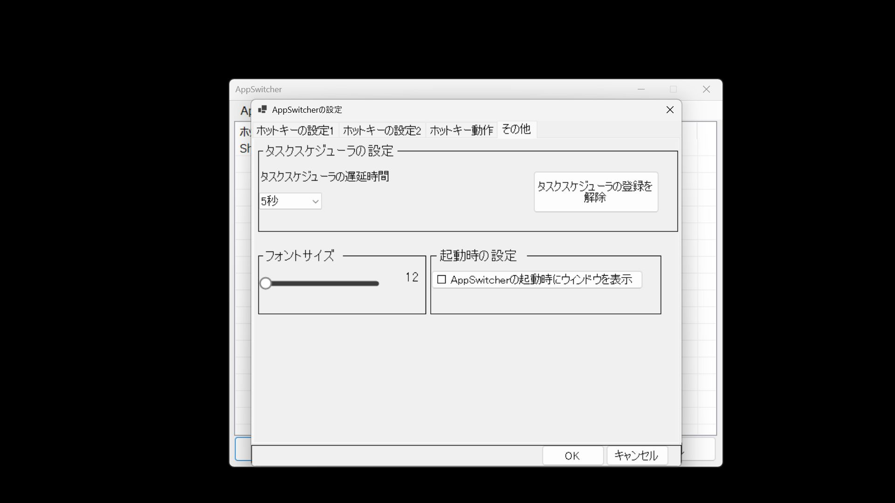

# AppSwitcher

AppSwitcher は、ホットキーでアプリケーションの表示・最小化を切り替える Windows 向けアプリケーションです。

## 主な機能

* ホットキーでアプリケーションの表示・最小化を切り替え
* アプリケーションの起動
* アプリケーションの終了
* 起動時の引数指定
* ウィンドウ位置・サイズの変更
* ウィンドウの最前面表示
* 音量・ミュート操作
* タイトルバー表示の切り替え

## 動作環境

* Windows 11

## インストール

1. Releases から ZIP ファイルをダウンロードします。
2. ZIP ファイルを解凍します。
3. `AppSwitcher.exe` を実行します。

## 基本的な使い方
### メイン画面
.jpg)
### 編集画面（ホットキーの編集）
.jpg)
メイン画面、
1. AppSwitcher を起動します。
2. 「追加」をクリックします。
3. 編集画面が開かれます。
4. 「アプリケーション名」に対象アプリのプロセス名を入力します。

   * 右側の選択ボタンを押すと実行中のプロセス一覧が表示されます。
   * 一覧から選択すると自動入力されます。
5. 修飾キー（Shift / Ctrl / Win / Alt）を選択します。
6. キーを選択します。
7. 「OK」をクリックします。
8. 設定したホットキーを押すと対象アプリの表示・最小化を切り替えられます。

---

## ファイル

### hotkey.txt

ホットキー設定を保存するファイルです。

保存内容の例：

* アプリケーション名
* ホットキー
* ウィンドウ設定
* 音声設定

### setting.txt

AppSwitcher の設定を保存するファイルです。
   
    
---

## 編集画面

.jpg)

- ### [アプリケーション名]
アプリケーションのプロセス名を入力します。
右側の選択ボタンから実行中のプロセスを選択することもできます。
- ### [アプリケーションのパス]
指定したプロセスが見つからない場合、このパスのアプリケーションを実行します。
- ### [引数の追加]
 アプリケーションのパスに引数を追加します。
- ### [ウィンドウタイトル]
 ホットキーで動作するウィンドウをタイトル名で指定できます。
- ### [説明]
入力した文字列をメイン画面の「アプリケーション名」欄に表示します。
- ### [ウィンドウの移動]
 チェック時にウィンドウの位置を指定します。[横位置]は横、[縦位置]は縦の位置です。
- ### [サイズの変更]
 チェック時にウィンドウのサイズの変更をします。[横サイズ]は横、[縦サイズ]は縦のサイズです。
- ### [対象のウインドウ]
 ウインドウを「すべてのウインドウ」、「メインウインドウのみ」、「タイトルが最初に一致したウインドウのみ」から選択できます。「すべてのウインドウ」は見つかったウインドウをすべて表示、最小化します。「メインウインドウのみ」はメインのウインドウの身を表示、最小化します。この設定の時はウインドウタイトルは使いません。「タイトルが最初に一致したウインドウのみ」はアプリケーション名ごとにウインドウタイトルが一致したウインドウのみを表示、最小化します。
- ### [不透明度の変更]
 チェック時、不透明度を変更することができます。横にあるボックス「固定」はスライダーの数値に変更します「＋」は元の数値からスライダーの数値分を追加します。「-」は元の数値からスライダーの数値分を減少します。「トグル」は不透明度２５５と横のスライダーの数値を交互に変更します。
- ### [タイトルバーの表示を変更する]
 チェック時、タイトルバーの表示を変更します。「トグル」の時、タイトルバーを非表示と表示を交互に行います。「表示」はタイトルバーの表示のみ行い非表示は行いません。「非表示」はタイトルバーの非表示のみを行い表示は行いません。
- ### [最前面表示の変更]
チェック時、ウィンドウを表示する際に最前面表示を変更します。「トグル」は最前面表示と最前面表示解除を交互に行います。「最前面」は最前面に表示します。非最前面は行いません。「非最前面」は最全面解除を行います。最前面表示はしません。
- ### [最大化して表示する]
 チェック時、ウィンドウを表示するときに最大化にします
- ### [ウインドウ動作を変更する]
チェック時、ウインドウの表示と最小化または非表示の操作を行わないようにできます。「最小化を行わない」はウインドウの表示の操作は行いますが最小化の操作は行いません。「表示を行わない」はウインドウの最小化の操作は行いますが表示の操作は行いません。「非表示、表示のトグル」はウインドウを見えなくする操作と表示する操作を交互に行います。
- ### [管理者権限で実行]
 チェック時、アプリケーションのパスを管理者権限で実行します。
- ### [アプリのパスを実行する前に通知で確認する]
 チェック時、アプリケーションのパスを実行する前に確認画面を表示します。
- ### [複数のアプリの実行時に間隔を開ける]
 チェック時にアプリケーションのパスに複数のアプリパスがあり実行するときに間隔を開けて実行します。[   ]半角スペース3つがあるときに選択できます。
- ### [アプリを終了する]
 チェック時、アプリが起動しているとき、終了します。
- ### [アプリの終了をする前に通知で確認する]
 チェック時、アプリの終了をする前に確認画面を表示します。

- ### [音声操作]
チェック時、音声操作を行えます。横のボックスで操作の内容を選べます
  - #### 「スピーカーのミュート、ミュート解除」
アプリケーション名の音声をミュート、ミュート解除をします。アプリケーション名をmasterにすると、全体の音声を変更します

  - #### [スピーカーのミュート]
 アプリケーション名の音声をミュートにします。アプリケーション名をmasterにすると、全体の音声をミュートにします
  - #### [スピーカーのミュート解除]
 アプリケーション名の音声をミュート解除にします。アプリケーション名をmasterにすると、全体の音声をミュート解除にします

  - #### [マイクのミュート、ミュート解除]
マイクのミュート、ミュート解除をします
  - #### [マイクのミュート]
マイクのミュートにします
  - #### [マイクのミュート解除]
マイクのミュート解除にします
  - #### [スピーカーの音量を上げる]
 スピーカーの音量をAppSwitcherの設定の音声の変化量分上げます。アプリケーション名がmasterの時は全体の音量を上げます。
  - #### [スピーカーの音量を下げる]
 スピーカーの音量をAppSwitcherの設定の音声の変化量分下げます。アプリケーション名がmasterの時は全体の音量を下げます。

  - #### [マイクの音量を上げる]
 マイクの音量をAppSwitcherの設定の音声の変化量分上げます。
  - #### [マイクの音量を下げる]
 マイクの音量をAppSwitcherの設定の音声の変化量分下げます。
 
 

 

### [IMEモードを半角英数字に変更する]
チェック時、ホットキー実行時にIMEを半角英数字モードへ変更します。

　

---

## [AppSwitcherの設定]

---

### [ホットキーの設定１]

#### ホットキーの追加、編集で表示する
チェックを入れたものをホットキーを編集で表示します。

---

### [ホットキーの設定２]

- ホットキーの設定
    - 「アプリケーション名のテキストボックスの横にチェックボックスを追加する」
アプリケーションのパスに入力、ウインドウタイトルに追加のいずれかにチェックが入っているときにチェックボックスを追加します

 追加したチェックボックスがチェックになっているときに右にあるコンボボックスのウインドウを選択するとアプリケーションのパス、ウインドウタイトルに入力されます。

### [ホットキー動作]

- 音声操作時の動作
   -   「音声操作時にウインドウを画面表示する」
 ホットキーの「音声操作」のチェックを入れているキーを押したときにウインドウを表示します。
 左はスピーカーかマイクのアイコン。上に変更したデバイス、またはアプリ名を表示。下にボリュームの表示

   - [音声ウィンドウの表示位置]

 ウィンドウの表示の位置を横の位置、縦の位置で指定できます。0,0の時は左上に表示されます。

   - 「背景の色」、「音量全体の色」、「現在音量の色」
ウインドウの色を指定できます。

   - 「音量の変化量」
スピーカー、マイクの音量の増減時、ここで指定した数を変化します。

   - 「音声ウインドウの表示時間」
 指定した秒数分、ウインドウの表示を続けます。

- アプリの実行、終了の設定
    - 「確認メッセージの表示方法」
ホットキーの編集で「アプリのパスを実行する前に確認する」、「アプリを終了する前に確認する」にチェックを入れているキーを押したときに表示されるものを設定できます。「通知」はwindowsの通知で右下に表示されます。「ウインドウ」は最前面の新規ウインドウで表示されます。

  -   「アプリの終了方法」
アプリの終了方法を「ウインドウを閉じる」、「プロセスの強制終了」から選べます。「ウインドウを閉じる」はウインドウのXボタンを押したときと同じ動作をします。「プロセスの強制終了」はタスクマネージャーのタスクを終了すると同じ動作をします。

    - 「複数アプリの実行間隔」
複数のアプリのパスを実行するときに間を開ける間隔を0.1秒から25秒までで設定できます。

 ---
 
 ### その他

 - [タスクスケジューラーの設定]
 タスクスケジューラーの設定ができます。[タスクスケジューラーに登録]をクリックするとログオン時から遅延時間の後AppSwitcherを管理者権限で実行します。[タスクスケジューラーの登録を解除]でスケジューラーの設定を削除します。

 - 起動時の設定
    - 「AppSwitcherの起動時にウインドウを表示する」
AppSwitcherの起動時にメイン画面のウィンドウを表示します。

- [フォントサイズ]
AppSwitcherの文字の大きさをスライダーで12~80までで設定できます。
